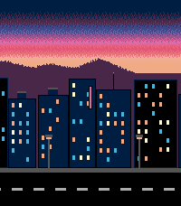
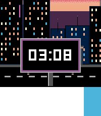

# Streaming Villa — a Pebble Time 2 watchface

A parallax cityscape at sunset. Three layers scroll right to left at different
speeds, and the time rides past on a billboard.

Built for the **Pebble Time 2 (emery) only** — 200x228, 64 colours. `main.c`
has a `#error` guard so it can't be built for another platform by accident.

## The layers

| layer | size | tiles | speed | contents |
|---|---|---|---|---|
| sky | 200x88 at y=0, opaque | 1 | static | the dithered sunset gradient |
| background | 200x40 at y=48, transparent | 6 | ~3.75 px/s | mountain ridge with a rim-lit crest |
| foreground | 200x200 at y=28, transparent | 8 | ~15 px/s | near towers with lit windows, street lamps, road |
| billboard | 320x122 at y=134, transparent | 1 | ~30 px/s | the billboard that carries the time |

The background is a shallow band and the towers are tall, so the sunset reads
as a thin strip above the horizon rather than half the display. Most towers
top out below the mountain valleys so the ridge stays visible behind them,
and a few landmarks cut up through it.

Depth comes from value as much as parallax: the mountains and the land below
them are mid purple, and the near towers are navy or black against it. The
billboard sits just over the top of the road, in front of the street, on a
single centre pole that runs off the bottom of the display.

Each scrolling layer is authored as one seamless panorama and sliced into
tiles. Every tile is at least as wide as the display, so any 200px viewport
lands on exactly two adjacent tiles — a layer draw is two `graphics_draw_bitmap_in_rect` calls
that the graphics context clips, and only two bitmaps per layer are ever
resident. Scrolling one tile forward reuses the previous right-hand tile, so
crossing a boundary costs a single resource load. The billboard panorama is a
single tile, so both halves of its draw share the one bitmap.

Scroll positions are kept in 1/16ths of a pixel so the slow layers can move at
fractional speeds without drifting.

### One colour, one definition

The mountain silhouette fills solid from its crest to the bottom edge of its
tile, and `scene_update_proc` fills the rest of the screen below with the same
colour, so the join at `y = SKY_H` is invisible. That colour is `HORIZON` in
`tools/gen_art.py` and the `GColorFromRGB(85, 0, 85)` fill in `main.c` — the
one pair of values in the project that must be changed together.

### The dithered sunset

The sunset is ordered-dithered so it fades rather than banding, which is why it
is a separate static bitmap instead of living in the scrolling background: a
dithered gradient that slid sideways would make the dither pattern crawl. Being
static also means it is blitted once per frame and never re-dithered at
runtime.

Each segment of the ramp mixes only its own two end colours, so the whole sky
stays inside a 16-entry palette. The stops are one 85-per-channel step apart —
navy, imperial purple, violet, purple, magenta, folly, melon, rajah, amber —
which is the smallest step the 64-colour display can make.

The threshold pattern is deliberately not a Bayer matrix. In a purely vertical
fade every pixel in a row shares the same blend fraction, and each row of a
Bayer matrix spans only part of the threshold range, so neighbouring rows land
at visibly different densities and the fade picks up horizontal streaks.
Instead each row walks the full 0..63 range in van der Corput (bit-reversed)
order — any prefix of which is spread evenly across the row — rotated by a
different random amount per row so the dots never line up into columns or
diagonals.

### When it animates

The scene does not scroll continuously. It runs for `BB_PASSES` billboard
passes — two — whenever the watchface is activated (pushed onto the stack, or
given focus back after a notification) and whenever the watch is tapped, then
holds still with the billboard centred.

A run is counted in passes rather than timed. The animation always rests at
the centred offset and always starts from it, so a pass is a well-defined unit:
`frame_timer` watches for the step that would carry the billboard back to that
offset, lands exactly on it — which also keeps every pass the same length —
and stops when the last one is done. Two passes work out at a little over 25
seconds, but nothing depends on that number.

`start_animation` is idempotent, and has to be: activation fires both
`.appear` and `did_focus`, about a second apart. It sets the pass count rather
than adding to it, and a run already in progress keeps its existing timer, so
a tap or a second activation event resets the count instead of extending the
run.

### The billboard gap

The billboard tile is 320px wide: the display width (200) plus the billboard
width (120). That makes the board clear the left edge at the exact moment its
repeat reaches the right edge, leaving no natural gap — so
`city_layer_set_pause` stalls the layer at that offset for two seconds. The
billboard is completely absent, and no time is drawn, for that beat.

### Notifications

A notification shrinks the window from the bottom. The interesting end of the
scene is down there — the street, and the base of the billboard — so
`scene_update_proc` reads `layer_get_unobstructed_bounds` on every draw and
slides the whole scene up by however much is covered, letting the sunset run
off the top instead.

Because the scene stops, sampling those bounds during the animation is not
enough on its own — an obstruction can arrive while the face is at rest. Two
subscriptions cover that: `unobstructed_area_service_subscribe` marks the
scene dirty as the notification slides in and out, and the minute tick does
the same so the time still updates on a still scene.

## Memory

Two tiles resident per scrolling layer, one each for the sky and the billboard,
each palettised at the narrowest bit depth its colour count allows:

    sky         1 x  8,800   =  8,800   (4-bit, 9 colours)
    background  2 x  2,000   =  4,000   (2-bit, 3 colours)
    foreground  2 x 20,000   = 40,000   (4-bit, 9 colours)
    billboard   1 x 19,520   = 19,520   (4-bit, 6 colours)
                             --------
                               72,320 bytes of emery's 128KB

Every layer's artwork stays at or under 16 unique colours, which is what lets
the resources be declared `SmallestPalette` — the SDK then picks the narrowest
bit depth each one actually needs, which is how the mountains come out at 2
bits. The build fails loudly if a layer ever exceeds 16, and
`tools/gen_art.py` prints each layer's colour count.

Resources are stored as `pbi` rather than `png`. PNG resources would be much
smaller on flash — the dithered sky especially — but decoding one needs a
transient buffer on top of the 72KB already resident, and the tiles are loaded
mid-animation.

## Artwork

There are no hand-drawn assets. `tools/gen_art.py` generates the sky and all
15 scrolling tiles procedurally (pure Python — it writes the PNGs itself, so
no Pillow needed):

    python3 tools/gen_art.py

It draws each layer onto a horizontally wrapping canvas, so shapes may straddle
the seam and the panoramas loop cleanly. All colours are on Pebble's 64-colour
grid. The layer geometry constants are duplicated in `tools/gen_art.py` and
`src/c/main.c` — change them in both or the layers stop lining up.

## Build

    pebble build
    pebble install --emulator emery      # emulator
    pebble install --cloudpebble         # a real watch, via the phone
