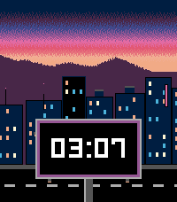
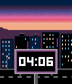
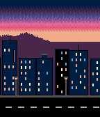
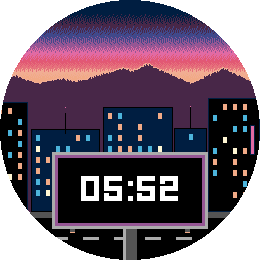
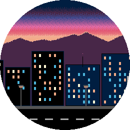
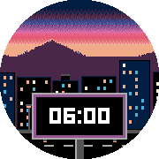
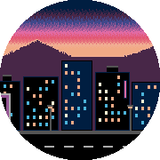
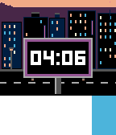

# Streaming Village — a Pebble watchface

A parallax cityscape at sunset. Three layers scroll right to left at different
speeds, and the time rides past on a billboard.

The first two are a Pebble Time 2; the last two are the same scene on a Pebble
Time.

And the two round watches — a Pebble Round 2 and a Pebble Time Round — where
the display crops the corners off every band.

Built for four platforms, all 64-colour displays, so they share a palette and
differ only in scale:

| platform | watch | display |
|---|---|---|
| emery | Pebble Time 2 | 200x228 |
| basalt | Pebble Time / Time Steel | 144x168 |
| chalk | Pebble Time Round | 180x180, round |
| gabbro | Pebble Round 2 | 260x260, round |

`main.c` has a `#error` guard so it can't be built for a platform it has no
layout for.

## The layers

| layer | tiles | speed | contents |
|---|---|---|---|
| sky | 1 | static | the dithered sunset gradient, opaque |
| background | 6 | ~3.75 px/s | mountain ridge with a rim-lit crest |
| foreground | 32, generated | ~15 px/s | near towers with lit windows, street lamps, road |
| billboard | 1 | ~30 px/s | the billboard that carries the time |

And where each one sits:

| layer | emery | basalt | chalk | gabbro |
|---|---|---|---|---|
| sky | 200x88 at y=0 | 144x64 at y=0 | 180x69 at y=0 | 260x100 at y=0 |
| background | 200x40 at y=48 | 144x29 at y=35 | 180x31 at y=38 | 260x45 at y=55 |
| foreground | 200x200 at y=28 | 144x147 at y=21 | 180x157 at y=23 | 260x228 at y=32 |
| billboard | 120x122 at y=134 | 86x89 at y=98 | 108x96 at y=105 | 156x139 at y=152 |
| billboard repeat | 320px | 230px | 288px | 416px |
| foreground loop | 6400px | 4608px | 5760px | 8320px |

Every platform scrolls at the same physical speed; what changes is the
panorama width. The foreground is not stored artwork — the watch draws each
tile as the scroll reaches it, which is what lets the panorama be 32 tiles
wide on every platform; see [The generated cityscape](#the-generated-cityscape).
See also [Four sizes, one layout](#four-sizes-one-layout).

The background is a shallow band and the towers are tall, so the sunset reads
as a thin strip above the horizon rather than half the display. Most towers
top out below the mountain valleys so the ridge stays visible behind them,
and a few landmarks cut up through it.

Depth comes from value as much as parallax: the mountains and the land below
them are mid purple, and the near towers are navy or black against it. The
billboard sits just over the top of the road, in front of the street, on a
single centre pole that runs off the bottom of the display.

The background is authored as a seamless panorama and sliced into tiles;
the foreground is generated a tile at a time on the watch. Every logical tile is at least as wide as the display, so any
viewport overlaps at most two adjacent tiles. Images entirely outside
the viewport are skipped; partially visible images are clipped by the graphics
context. Only two bitmaps per layer are ever resident. Scrolling one tile forward
reuses the previous right-hand tile, so crossing a boundary costs a single
tile — loaded for the background, drawn for the foreground. The billboard panorama is a single tile, so both halves of its
draw share the one bitmap. Its stored image omits the transparent margins on
each side: it is drawn at a half-display inset within the unchanged logical tile.

Scroll positions are kept in 1/16ths of a pixel so the slow layers can move at
fractional speeds without drifting.

### One colour, one definition

The mountain silhouette fills solid from its crest to the bottom edge of its
tile, and `scene_update_proc` fills the rest of the screen below with the same
colour, so the join at `y = SKY_H` is invisible. That colour is `HORIZON` in
`tools/gen_art.py` and the `GColorFromRGB(85, 0, 85)` fill in `main.c` — the
one pair of values in the project that must be changed together.

### The dithered sunset

The sunset is ordered-dithered so it fades rather than banding, which is why it
is a separate static bitmap instead of living in the scrolling background: a
dithered gradient that slid sideways would make the dither pattern crawl. Being
static also means it is blitted once per frame and never re-dithered at
runtime.

Each segment of the ramp mixes only its own two end colours, so the whole sky
stays inside a 16-entry palette. The stops are one 85-per-channel step apart —
navy, imperial purple, violet, purple, magenta, folly, melon, rajah, amber —
which is the smallest step the 64-colour display can make.

The threshold pattern is deliberately not a Bayer matrix. In a purely vertical
fade every pixel in a row shares the same blend fraction, and each row of a
Bayer matrix spans only part of the threshold range, so neighbouring rows land
at visibly different densities and the fade picks up horizontal streaks.
Instead each row walks the full 0..63 range in van der Corput (bit-reversed)
order — any prefix of which is spread evenly across the row — rotated by a
different random amount per row so the dots never line up into columns or
diagonals.

### When it animates

The scene does not scroll continuously. It runs for `BB_PASSES` billboard
passes — two — whenever the watchface is activated (pushed onto the stack, or
given focus back after a notification) and whenever the watch is tapped, then
holds still with the billboard centred.

A run is counted in passes rather than timed. The animation always rests at
the centred offset and always starts from it, so a pass is a well-defined unit:
`frame_timer` watches for the step that would carry the billboard back to that
offset, lands exactly on it — which also keeps every pass the same length —
and stops when the last one is done. Two passes work out at a little over 25
seconds on emery, a little under 20 on basalt, a little over 23 on chalk and
a little under 32 on gabbro, but nothing depends on those numbers.

`start_animation` is idempotent, and has to be: activation fires both
`.appear` and `did_focus`, about a second apart. It sets the pass count rather
than adding to it, and a run already in progress keeps its existing timer, so
a tap or a second activation event resets the count instead of extending the
run.

Taps while unfocused cannot restart the animation. Each timer step still
advances all three scroll positions, but requests a redraw only if an integer
pixel position changes (or the run ends). An uninterrupted run takes 506 steps
and requests 486 animation redraws on emery, 386 and 366 on basalt, 462 and
442 on chalk, 634 and 614 on gabbro; in every case the remaining 20 steps
change only fractional
positions during the billboard pauses. `tests/power_savings.c` pins those
counts.

### The billboard gap

The billboard tile is one display width plus one billboard wide — 320 = 200 +
120 on emery, 230 = 144 + 86 on basalt, 288 = 180 + 108 on chalk,
416 = 260 + 156 on gabbro. That makes the board clear the left
edge at the exact moment its repeat reaches the right edge, leaving no natural
gap — so
`city_layer_set_pause` stalls the layer at that offset for two seconds. The
billboard is completely absent, and no time is drawn, for that beat.

### Notifications

A notification shrinks the window from the bottom. The interesting end of the
scene is down there — the street, and the base of the billboard — so
`scene_update_proc` reads `layer_get_unobstructed_bounds` on every draw and
slides the whole scene up by however much is covered, letting the sunset run
off the top instead.

Because the scene stops, sampling those bounds during the animation is not
enough on its own — an obstruction can arrive while the face is at rest. Two
subscriptions cover that: `unobstructed_area_service_subscribe` marks the
scene dirty when the notification's integer vertical displacement changes,
and the minute tick does the same so the time still updates on a still scene.

## Memory

Two tiles resident per scrolling layer, one each for the sky and the billboard,
each palettised at the narrowest bit depth its colour count allows. Rows are
byte-aligned, so a 4-bit tile costs `ceil(w/2)` bytes per row and a 2-bit one
`ceil(w/4)`:

                emery       basalt       chalk      gabbro
    sky         1 x  8,800  1 x  4,608  1 x  6,210  1 x 13,000  (4-bit, 9 colours)
    background  2 x  2,000  2 x  1,044  2 x  1,395  2 x  2,925  (2-bit, 3 colours)
    foreground  2 x 20,000  2 x 10,584  2 x 14,130  2 x 29,640  (4-bit, 9 colours, generated)
    billboard   1 x  7,320  1 x  3,827  1 x  5,184  1 x 10,842  (4-bit, 6 colours)
                  --------    --------    --------    --------
                    60,120      31,691      42,444      88,972

                of 128KB     of 64KB     of 64KB     of 128KB

Chalk is the tightest: it has basalt's 64KB heap but a display half again as
large in area, which leaves about 13KB clear once the tiles are resident.
Basalt has the most room of the four — the firmware reports a 32,384-byte peak
against a 62,400-byte heap, the difference from the table being the `GBitmap`
structs themselves. Halving the display width is close to halving
the bitmap cost, which is why the artwork is regenerated per platform rather
than reused — two 200x200 foreground tiles alone would be 40KB of basalt's
64KB, and a 200px tile on gabbro's 260px display would let the viewport
straddle three logical tiles, which the two-slot cache cannot serve.

Every layer's artwork stays at or under 16 unique colours, which is what lets
the resources be declared `SmallestPalette` — the SDK then picks the narrowest
bit depth each one actually needs, which is how the mountains come out at 2
bits. The build fails loudly if a layer ever exceeds 16, and
`tools/gen_art.py` prints each layer's colour count.

The foreground tiles are generated rather than stored, so they cost heap but
no flash — the two resident tiles are the same size either way.

Resources are stored as `pbi` rather than `png`. PNG resources would be much
smaller on flash — the dithered sky especially — but decoding one needs a
transient buffer on top of everything already resident, and the tiles are
loaded mid-animation. Uncompressed, the packs come to 32,527 bytes on emery,
19,106 on basalt, 24,171 on chalk and 45,799 on gabbro, each against a 256KB
per-platform limit. `tests/test_billboard_art.py` asserts every platform's
pack stays inside the budget, and that the foreground has not crept back into
it.

## The generated cityscape

The eight stored foreground tiles used to be 80-85% of every platform's
resource pack: 163KB of emery's 193KB, 180KB of gabbro's 224KB. That is what
capped gabbro's panorama at six tiles — a 260x228 tile costs 29,640 bytes, so
eight would have been 237KB of the 256KB the appstore allows, before anything
else went in the pack.

`src/c/city_gen.c` draws them instead, and the whole pack drops to 19-46KB.
The `.pbw` went from 678KB to 145KB, and the panorama went from eight tiles
to 32 on every platform, the old gabbro special case with it.

What makes a tile drawable on its own is that nothing accumulates along the
panorama. Towers sit in `FG_SLOTS` evenly spaced cells, and everything about
the tower in cell *n* — where in the cell it stands, how wide and tall it is,
which windows are lit, what sits on its roof — comes from *n* alone, by way of
a Splitmix32 seeded from it. So a tower straddling a tile boundary is drawn
twice, once as one tile's overhang and once as the next tile's, and comes out
identical both times because neither drawing knows which tile it is in. Cell
indices run over all of the integers: index *i* is cell *i* mod `FG_SLOTS` of
turn *i* / `FG_SLOTS`, so the panorama wraps with no seam case at all — tile 0
simply draws the negative-index towers hanging over from the previous turn.

Because the panorama is fixed and the whole of it is reachable, the watchface
starts at a random point in it rather than at tile 0, so the same stretch of
city is not the first thing on screen every time the face is loaded. That is a
random *offset*, not a random city: changing the seed would change what the
towers look like, and the generator is only checkable because the seed is
pinned. The billboard is left where it is — its rest position is where the
clock ends up.

The street is periodic rather than indexed by slot, but it has the same
constraint, and its authored spacing divides the panorama width on basalt
alone. Dashes and lamps are therefore counted out across the panorama instead
of stepping by a fixed pixel pitch, which also fixed a phase jump the stored
artwork had at the wrap on the other three.

Generating a tile costs about 1.8x its own size in pixel writes — 19KB over
788 fills on basalt, 53KB over 1,660 on gabbro — and happens once every
192 frames on basalt to 347 on gabbro, which at 20fps is once every 10 to 17
seconds. Measured on emery hardware, a 200x200 tile takes **1.09 ms** (64
back-to-back generations in 70ms, repeatably) against a 50 ms frame, so a
crossing spends about 2% of the frame it lands in. It replaces a flash read
and decode of a bitmap of exactly the same size, on that same frame, so the
frame is no busier than it was when the tiles were stored.

Nothing describes the cityscape any more except the code that draws it, so
`tools/gen_art.py` keeps the same generator in Python — it is where the
artwork was authored, and it still draws the appstore icons from the same
shapes — and `tests/test_city_gen.py` renders both and compares every pixel,
on every platform, for all 32 tiles plus a set of deliberately misaligned
spans. `python3 tools/gen_art.py --preview` writes the whole scene out as one
wide PNG to look at, and `--verify` checks span independence without the C.

## Four sizes, one layout

Nothing in `src/c/city_layer.c` knows a display size: it culls against
`PBL_DISPLAY_WIDTH` and `MIN_TILE_W` is that same width. The scene geometry
lives entirely in `main.c`'s `#define` block, and rather than list it twice it
is *derived* from the emery reference by the same integer scaling
`tools/gen_art.py` applies to the artwork:

    #define SCALE_Y(v) ((v) * PBL_DISPLAY_HEIGHT / EMERY_H)
    #define SKY_H SCALE_Y(88)

Both scalings are the identity at 200x228, so the emery numbers fall out of
the macros unchanged, and the two files stay in step by construction instead
of by remembering to edit both. The relationships the layout rests on — the
ridge sitting on the sky's bottom edge, the street landing on the bottom of
the display, a billboard tile being one display plus one board — are asserted
in `tests/test_billboard_art.py`, so a drift between generator and watchface
fails a test rather than showing up as a seam on the watch.

Only two values genuinely differ per platform: the billboard's panel margin
and the clock face. The system
fonts come in fixed sizes, so the digits step to the nearest one that clears
the panel: `FONT_KEY_LECO_32_BOLD_NUMBERS` will not fit basalt's 32px panel or
chalk's 34px one whatever its width, so both use
`FONT_KEY_LECO_26_BOLD_NUMBERS_AM_PM`, and gabbro's 49px panel goes the other
way to `FONT_KEY_LECO_36_BOLD_NUMBERS`.

### The round ones

chalk and gabbro are round, and nothing in the code accounts for that. There
are no `PBL_ROUND` branches: the bands stay full width and the display simply
crops the corners off them. That is the right answer here rather than a
shortcut — the scene is horizontal by construction, so what the circle takes
is sky at the top corners, the far ends of the ridge, and kerb at the bottom
corners, none of which carry information. The one thing that has to stay
inside the circle is the clock panel, and it clears the inscribed circle at
every corner with room to spare on both: x 43..137 / y 114..148 on chalk,
x 62..198 / y 165..214 on gabbro.

### Per-platform resources

The four artwork sets share one set of resource names. `package.json` declares
the bare `images/bg_0.png`, and the SDK's `find_most_specific_filename`
resolves it to `bg_0~emery.png`, `bg_0~basalt.png`, `bg_0~chalk.png` or
`bg_0~gabbro.png` from the platform's tags — so there is one media entry per
image, one `RESOURCE_ID_IMG_BG_0`, and one id array in `main.c`.
`menu_icon.png` is identical on all four and stays untagged.

## Artwork

There are no hand-drawn assets. `tools/gen_art.py` generates the sky, the
mountain ridge and the billboard procedurally — 8 images per platform — for
all four platforms in one pass (pure Python — it writes the PNGs itself, so no
Pillow needed):

    python3 tools/gen_art.py

It draws each layer onto a horizontally wrapping canvas, so shapes may straddle
the seam and the panoramas loop cleanly. All colours are on Pebble's 64-colour
grid.

It also carries the cityscape generator, which is the one part that does not
ship as artwork — `src/c/city_gen.c` draws that on the watch, and the Python
is the reference the C is tested against. See
[The generated cityscape](#the-generated-cityscape).

Geometry lives in a `Layout` per platform, scaled from the emery reference the
same way `main.c` scales its `#define`s. Decorative detail is *not* scaled and
is listed per platform in `EMERY_DECO` / `BASALT_DECO` / `CHALK_DECO` /
`GABBRO_DECO`: at 0.72x a window grid turns to mush and a rim light
disappears, and at 1.3x it looks sparse, so window pitch, lamp spacing, dash
length and the like are chosen rather than computed. Because the scaling is
the identity at 200x228, regenerating has to leave the emery PNGs
byte-identical — that is the regression check for any change in this file.
The cityscape is the exception: it is no longer written out, so
`tests/test_city_gen.py` compares it against the C instead.

## Store animations

`tools/capture_loop.py` records the scene in motion, one animated GIF per
platform, for the storefront listings:

    tools/capture_loop.py                 # every target platform
    tools/capture_loop.py basalt chalk    # just these

GIF is the default because it is the only format the stores actually animate.
They reject WebP outright, and they accept an APNG upload but serve back only
its first frame. `--format apng` and `--format webp` still write those — both
are smaller and exactly lossless, so they are worth keeping as masters — and
`--convert` re-encodes whatever is already in `screenshots/` into another format
without going near the emulator:

    tools/capture_loop.py --format apng   # lossless masters
    tools/capture_loop.py --convert       # masters -> GIF for the store

The script installs the app in the emulator, waits for the activation run to
come to rest, taps the watch to start a fresh one, and pulls frames off the
QEMU monitor with `screendump`. `pebble screenshot --gif-all-platforms` is the
obvious alternative and is the wrong tool here: it records a fixed seven-second
clip straddling a minute boundary, and this scene only animates in bursts, so
by the time that capture starts the run has long since stopped.

### One pass, and finding where it ends

The clip is one billboard pass. A run is a whole number of passes and both
starts and ends at the centred offset, so one pass is the shortest segment that
begins and ends with the billboard — and so the clock — in the same place. It
is not a perfect loop, and nothing short enough to be one exists: the three
layers have incommensurate periods, 193 frames against 1536 and 4608 on basalt,
so the whole scene only returns to its starting state after minutes. A pass
puts the cut where it shows least, with the billboard, the clock and the road
identical across it and only the skyline behind them stepping along.

The seam is measured rather than assumed, by tracking the clock panel — the
only near-white thing in its band — and ending the pass where it returns to
where it started. Two things make that harder than it sounds, and both produced
wrong clips before they were handled. Comparing whole frames does not work at
all: the layers that cannot line up dominate the difference, enough to pick a
frame most of a pass away. And the search has to be confined to the single
crossing between one stall and the next. Before the stall the board has not
gone anywhere yet; and stray near-white pixels from the lit windows jitter the
measured centre by a fraction of a pixel, so walking outward until the distance
grows stops on the jitter rather than at the seam. Within the window the best
match is unambiguous, and every platform lands within a pixel. A seam further
off than that, or a pass more than a quarter away from the length the constants
imply, is an error rather than a bad file.

### Timing the emulator will not give you

Nothing about the emulator's timing can be taken on faith. Installing the app
activates it, which starts a run of its own, and that has to finish before the
tap or the tap merely extends it — so the script watches the billboard until it
stops instead of sleeping on the nominal figure. Sleeping was not paranoid
enough: because a run ends a fixed number of billboard crossings after the tap
rather than a fixed time, an early tap can leave the scene coming to rest
*inside* the capture, and then every resting frame matches the first one and the
seam lands anywhere. Nor does the emulator keep app timers to `FRAME_MS`: a
basalt pass takes 8.9s of wall clock against the 9.65s the constants specify,
and under load gabbro stretched the other way, 19.0s against 15.85s. So the
frames are played back over the nominal duration rather than the recorded one,
which is what makes the animation run at the speed a watch runs it.

Getting that onto a GIF takes one more step, because a GIF holds no frame rate:
it holds a delay per frame, in whole hundredths of a second. None of these
passes runs at a rate that divides into that — basalt's 18.4 fps would round to
5cs and play 8% fast, losing exactly the pacing above. Rounding each frame's
*cumulative* position instead spreads the error, so frames come out 5cs or 6cs
and the total is exact to the centisecond. ffmpeg can only be told a constant
rate, and feeding it per-frame durations through the concat demuxer comes back
quantised into a 4cs/8cs stutter, so the delays are written into the encoded
file afterwards — two bytes in each frame's control block. It is worth keeping
ffmpeg for the encode: it rewrites pixels that did not change as the
transparent index, which this scene compresses to about half of what writing
whole frames does.

### Colour and the unlit panel

Nothing that can be injected lights the backlight on a watchface, so the panel
is recorded unlit — a flat 67% linear scale — and scaled back up per frame.
That reconstruction is good to a single level but not exact, because the
emulator floors some channels on the way down: the palette lands on 84 and 170
where the display's 64-colour grid has 85 and 170.

The GIFs are visibly lossless. basalt, emery and gabbro come back pixel-for-
pixel identical to the APNG masters, because the art uses fifteen colours and a
GIF holds 256. chalk is the one exception, and only at the rim: its emulator
antialiases the edge of the round display, which pushes the count to 259 and
over what is left after reserving an entry for transparency, so 0.4% of its
pixels shift by at most 6 of 255. The round displays keep their transparent
corners, which is also why their frames carry a dispose-to-background flag
rather than the retain-previous one the rectangular platforms use.

At 230 KiB to 2.2 MiB the files are large but within what the stores take;
`--frame-step N` roughly halves the size per doubling if one of them ever
refuses, and shortens nothing.

## Build

    pebble build                         # builds all four platforms
    pebble install --emulator emery      # emulator
    pebble install --emulator basalt
    pebble install --emulator chalk
    pebble install --emulator gabbro
    pebble install --cloudpebble         # a real watch, via the phone

gabbro needs a recent SDK: it first appears in 4.33.1.

After changing `targetPlatforms`, run `pebble clean` first: waf caches the
configured platform set and will otherwise keep building the old one.

## Regression checks

After a build has generated the resource headers, run the C handler and draw
geometry checks on the host (requires GCC and the Pebble SDK):

    PEBBLE_SDK_PEBBLE=/path/to/sdk-core/pebble bash tests/run_host_tests.sh
    python3 -B tests/test_billboard_art.py

`run_host_tests.sh` covers every platform by default; pass names to narrow it.

The host checks replace platform timers and graphics calls with recording
stubs. They cover focus loss and taps, animation completion and redraw counts,
minute updates, obstruction movement, and billboard placement across every
scroll position in a tile with several notification offsets. The artwork check
compares each platform's cropped resource with the original full-width
procedural artwork, asserts the layout invariants `main.c` derives from, and
sizes each platform's resource pack against the 256KB appstore ceiling.

## Licence

MIT — see [LICENSE](LICENSE). The generated artwork is covered by it too: there
are no third-party assets in this repository, because `tools/gen_art.py` draws
every image from scratch.
